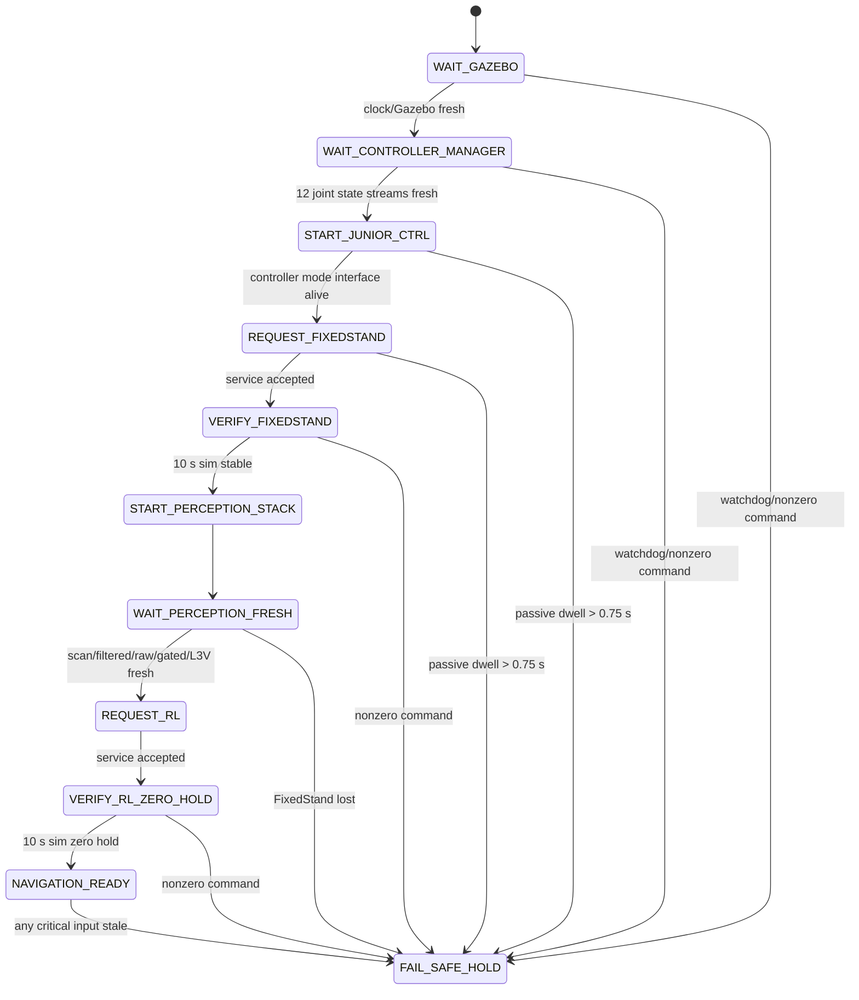

# A1 deterministic safe-startup supervisor V1

The supervisor is a separate Python process.  It never subscribes to Gazebo
model/link state, `/Odometry_gazebo`, `generated_building` metadata, or any
truth file.  Gazebo truth remains allowed only in separate offline acceptance
capture and is not an input to this process.

The 0.75 s simulation-time PASSIVE limit is deliberately below the observed
failed delayed-start point (2.770 s) and above the previously observed
immediate controller startup latency.  It is a guard, not a performance goal.

The supervisor alone publishes `/cmd_vel`, at 10 Hz with all components zero.
It publishes `/unitree/navigation_ready` at 20 Hz.  A consumer must require a
fresh receipt within 0.75 wall seconds and treat any missing/stale heartbeat as
false.  `navigation_ready=true` requires only L3V input freshness, not
`safe_for_navigation=true`; no navigation runner is launched by this task.
